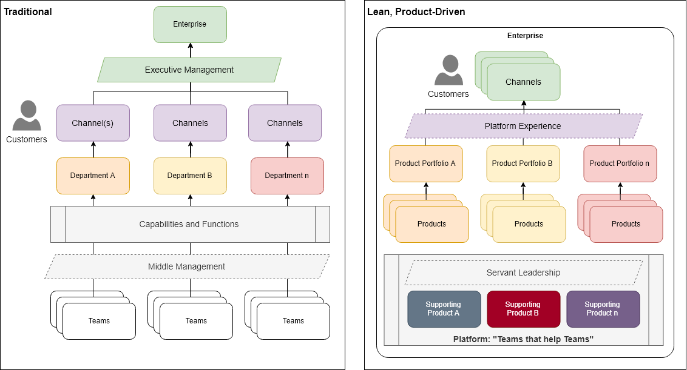
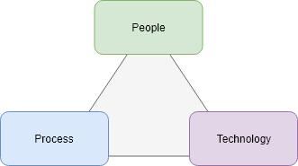

#  Welcome to Ourchitecture

Dedicated to Open Architecture, this site provides some useful resources for Technology Architects and the people they work with.

[*app-patreon]

**Business people:** working with technologists will be hard because you do not usually understand technology and they do not usually understand business. You generate waste when you do not focus on enabling valuable outcomes.

**Technologists:** working with business people will be hard because you do not usually understand business and they do not usually understand technology. You generate waste when you do not focus on enabling valuable outcomes.

**Business-Technology Translators:** You will go far, so long as you focus on enabling valuable outcomes.

## Architecture

In ["What is IT Architecture"](https://iasaglobal.org/itabok/what-is-it-architecture/), the International Association of Architecture (IASA) defines an IT Architect as the technology strategist for the business and IT Architecture as the art and science of designing and delivering valuable technology strategy. Wikipedia takes a more traditional and verbose approach to [their definition of IT Architecture](https://en.wikipedia.org/wiki/Information_technology_architecture).

Architects, whether formally trained and certified or developed through experience, come from a variety of backgrounds and the title and roles of an architect at any company vary significantly. Generally, there are a few distinct [roles of architecture](./roles) performed by architects.

## Organizational Topology

[[Organization]]

* Customers
* Business Units / Departments
* Channels and Devices
* Journeys
* Capabilities and Functions
* Products and Services
* Portfolios
* Platforms
* Communities

## Topic Categories

[](https://www.draw.io?lightbox=1&target=self&highlight=0000ff&edit=https%3A%2F%2Fgithub.com%2Fourchitecture%2Fsite-ionic-ng%2Fblob%2Fmaster%2F.github%2FCONTRIBUTING.md&nav=1&title=people-process-technology.drawio#RxZbfc6IwEMf%2FGh91gADCY8%2F%2BmundtDNe554jWUnawDIhVO1ffwGihurZa8dO8cHsd3cDu58NOiKzYn2jaMV%2FIQM5Cjy2HpHLURD4vheYr1bZ9EocJ72QK8Fs0F6Yi1ewomfVRjCoB4EaUWpRDcUMyxIyPdCoUrgahi1RDu9a0RwOhHlG5aH6RzDNd3V5e8ctiJzbWyeRdRR0G2yFmlOGK0ciVyMyU4i6XxXrGci2edu%2B9HnX%2F%2FDuHkxBqf8r4fYCf%2FLH4u718s6%2FL9OajdOxpfNCZWMLtg%2BrN9sOaCVombfWjxUXGuYVzVrXygA3GteFNJZvlgo11QJLY45TzwhLIeUMJapuJ7KM2o%2FRa63wGRxP3F1tBpba0fvL6IfF2vpfQGlYO5It%2FgawAK02JsR6CbEg7CT607i3Vw7XMO017iD1Uzuy1M5Svtt7326zsB3vzMca1P3iqZ3IwJN0AbJPfQCsTCu77aQon3uVa92O80W7W3CNjcraRme6UTDJhebNYiLQeCon%2ByRWtxN2DByiCpuSAbPU3oH6hiGLIGHhMYZJsCAdw3OwCsNJ9D6t7dFyacXeh2EZ0%2BF1kt9vyHhpas43n2Wo3%2BxwkmP4ZRzBNySnxzim8ZTQM3EMo%2BGZI9vX5vdSfFCYQV1%2F%2Bhi66Sf5RV93Dikky%2BzouzRLYLE8D78g%2FFZ%2BRtr%2FPnbhzr8McvUX)

In his 1964 paper "Applied Organization Changes in Industry" Harold Leavitt coined the phrase people, process, and technology. The triad has served as a guiding reference for decades and [continues today](https://www.cio.com/article/3331993/one-cio-s-perspective-on-the-people-process-and-technology-formula-for-business-success.html).

* [[People]]
* [[Process]]
* [[Technology]]
